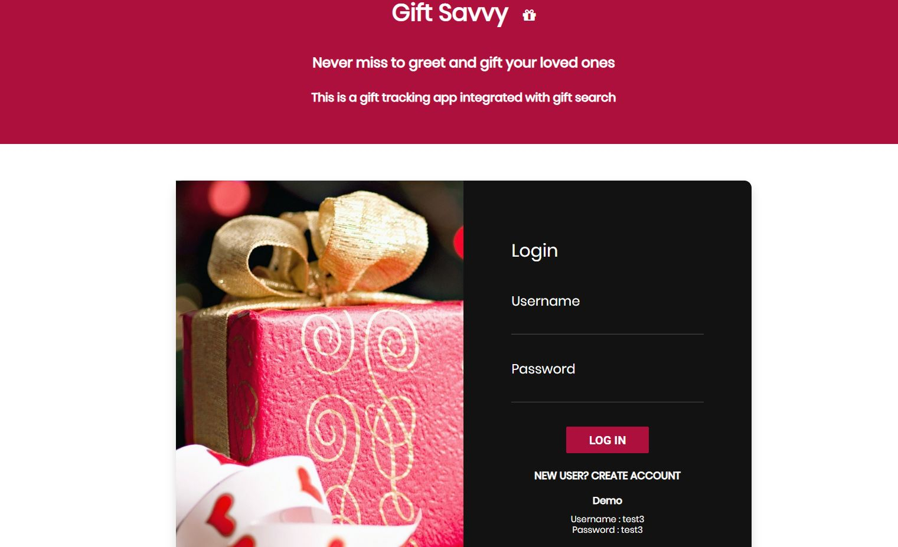
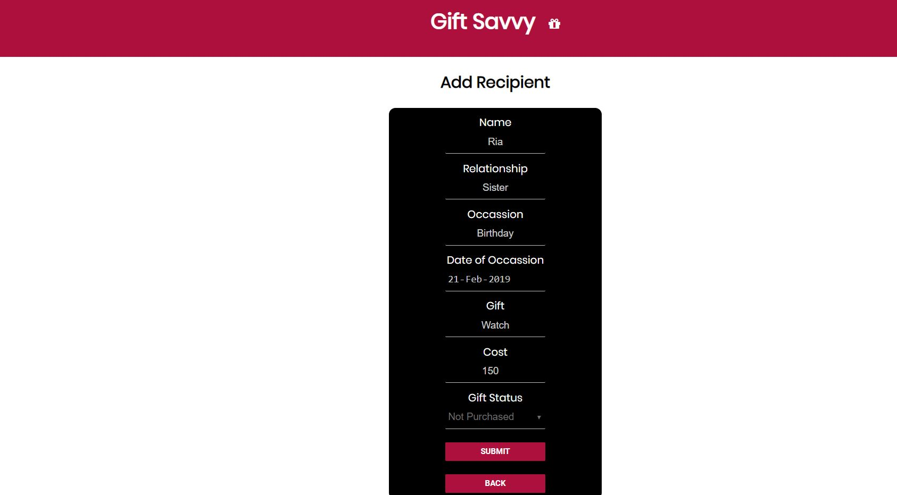
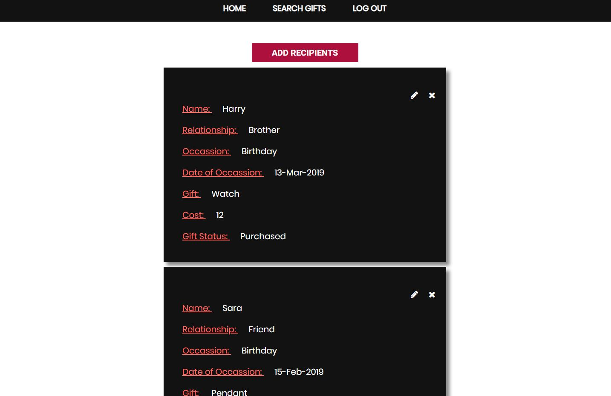
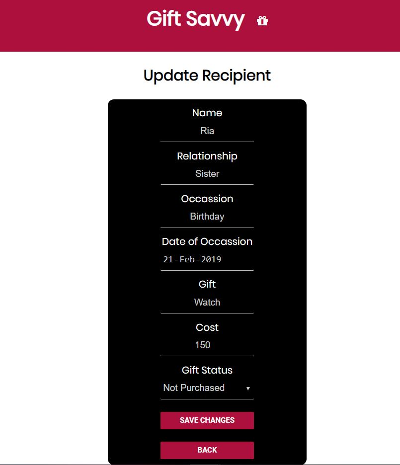
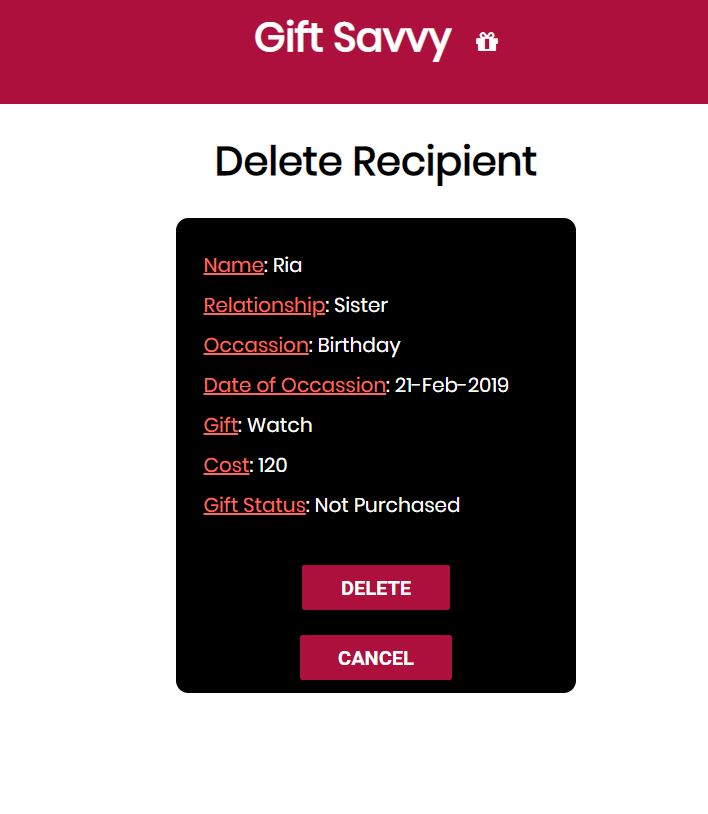
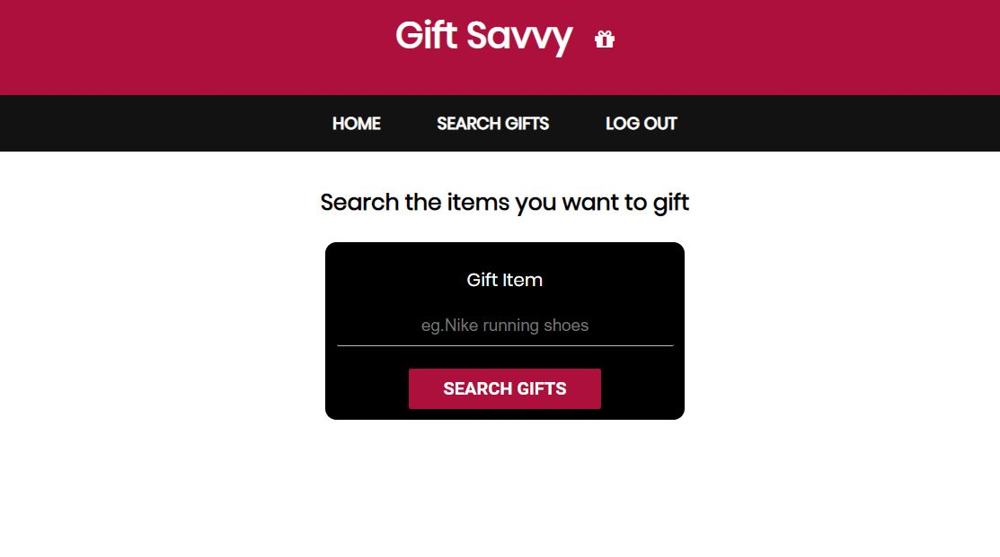
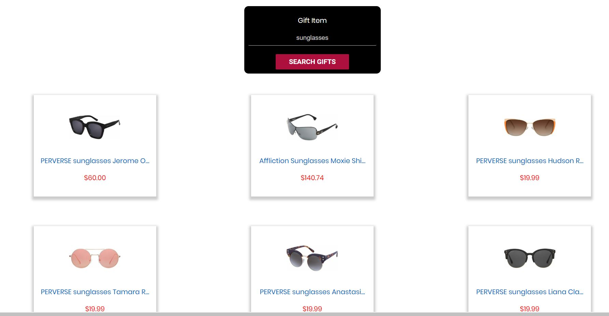

# Gift Savvy

This is a full stack web application used for tracking gifts along with gift search integration.It is built using **HTML,CSS,Javascript,Node JS, Express, React,Redux, Mongoose, Mocha, Chai and Enzyme**. It also uses **VIGLINK API** for Gifts Search.

For live demo click the below link,

https://gift-savvy.herokuapp.com

Demo Account Credentials:
Username: test3
Password: test3

Client Github Repo: https://github.com/shravanipl/gift_savvy

Server Github Repo: https://github.com/shravanipl/gift-savvy-server

Follow the below steps to use the application

1. Below is the entry page where existing user needs to enter the Username and Password given during Account Creation.After successful validation the user will be redirected to the **Home** page

2.For new user, click on the link **NEW USER?CREATE ACCOUNT** which returns the below page

3.Enter all the details and click the button **REGISTER** which redirects to the **Home** page or the dashboard where the user can add all recipients.

4.After adding the recipients, it will be redirected again to the **Home** page

5.To **Edit** recipient info, click on the **Pencil button**, after which a pop up will be shown as below

6.To **Delete** recipient, click on the **Delete** button if you want to delete the recipient permanently or **Cancel** if you wish to retain.

7. You can search the gifts you wish to gift by clicking  **Search Gifts** link.

8.Enter the items you wish to gift by clicking **SEARCH GIFTS** button. 

9.Based on the search term, items will be displayed as shown below if not found suitable error message will be displayed.

10.On click of each item, it will be redirected to the merchant website where the user can purchase the gifts.
